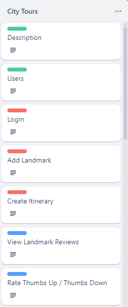
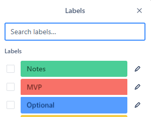
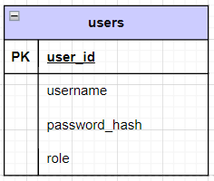

# Module two final project

There are four options for this final project:

1. Create and implement your own application.
1. Implement an application for a [Trello board project](https://trello.com/b/SHSRQCza/te-module2-final-projects).
1. If you completed a custom application for the mid-module project, you can extend and build upon it for the final project.

If you decide to create your own application or extend upon your mid-module project, **you must confirm your application proposal with your instructor.**

## Design Requirements

All applications must include project design documents, charts, and/or diagrams.
 * Place the database ERD in the `database` folder.
 * Submit all other required design documents in the `design` folder at the root of this project.
# Module Three final project

There are 2 options for the Module-3 final project:

1. Design and implement your own custom front-end application utilizing your Module 2 Final Project.
2. Implement a front-end application for a different [Trello board project](https://trello.com/b/SHSRQCza/te-module2-final-projects) (but then you'd also have to implement the corresponding back-end application and database, as described in your Module 2 Final Project README).

## Design Requirements

All applications must be accompanied by project design documents, wireframes, mockups, and/or diagrams.
 * Required design documents must be submitted along with the source code in the `client/design` folder.
 * Recommended design documents are optional.

### Required

* [**Custom project only**] Documentation of functional requirements to act as the application's Minimum Viable Product ([MVP](https://en.wikipedia.org/wiki/Minimum_viable_product)).
  * A functional requirement describes what the application can do or provide from a user's perspective.
  * Capture functional requirements as a *[user story](https://en.wikipedia.org/wiki/User_story)*. Examples:
    * "As an unauthenticated user, I can review a list of products for sale."
    * "As an authenticated user, I can clear my cart, removing all items from the cart."
  * At least one functional requirement must require authentication
* Database ERD diagram which includes:
  * At least one table in addition to the provided users table
  * At least one many-to-many OR one-to-many relationship between tables
  * All columns, relationships, and constraints for each table
* API endpoint design document which includes a list of all endpoints:
  * List HTTP method and URL
  * Indicate any path variables or query parameters
  * Indicate if the endpoint requires authentication and/or authorization roles
  * Success and error status codes
  * Any JSON request and/or response body schemas

Below is an example of API endpoint design table:

| Endpoint               | Method | Query Parameters                        | Description                   | Success | Error    | Authentication   |
|:-----------------------|:------:|:----------------------------------------|:------------------------------|:-------:|:---------|:-----------------|
| /api/reservations      |  GET   | dateto, optional<br/>datefrom, optional | Get all reservations          |   200   | 400      | None             |
| /api/reservations      |  POST  | None                                    | Create a new reservation      |   201   | 400, 422 | Required         |
| /api/reservations/{id} |  GET   | None                                    | Get a specific reservation    |   200   | 404      | Creator or ADMIN |
| /api/reservations/{id} |  PUT   | None                                    | Update a specific reservation |   200   | 404, 409 | Creator or ADMIN |
| /api/reservations/{id} | DELETE | None                                    | Delete a specific reservation |   204   | 404      | ADMIN            |

### Recommended

* Class summaries
  * Instance variables
  * public methods
  * Inheritance or interface relationships
  * Examples:
    * DAO interfaces with method descriptions
    * Model classes
      * DTO @valid checks
    * Service classes
* Flow charts or [Sequence diagrams](https://en.wikipedia.org/wiki/Sequence_diagram)
  * Summarize end-to-end HTTP request to HTTP response for API endpoints
* Database Integration Test Plan
  * Happy Path test cases
  * Corner cases
  * Success criteria
  * Mock users and/or mock test data

## Project Requirements

At a minimum, your application must meet the following minimum requirements:

* Have a clear purpose, function, or utility.
* Document at least five functional requirements with at least one requiring an authenticated user.
  * If choosing a Trello project, complete all, or at least five, of the MVP (red) User Stories. **Make sure to confirm your 5 functional requirements with your instructor.** 
  * The provided login and registration flow **can not** be used as one of the five functional requirements.
  * Requirements utilizing the methods from the provided `userDao` class **can not** be used as one of the five minimum functional requirements.
* Use Spring Boot and Postgres to create a backend web service.
* Implement a REST API with appropriate, authenticated endpoints.
  * At least one endpoint must require *meaningful* authentication.
* Use the DAO pattern to access the database.
* Provide a SQL script to create database tables and any mock data.
* Use an external API in a *meaningful* way.
  * The following are sites which have link to free, public web APIs
    * [Public APIs](https://github.com/public-apis/public-apis)
    * [rapidapi](https://rapidapi.com/collection/list-of-free-apis)

## Creating an application from a Trello Board Project

[Trello Board projects](https://trello.com/b/SHSRQCza/te-module2-final-projects) contain *[user story](https://en.wikipedia.org/wiki/User_story)* cards, which act as the project's functional requirements.
Each card in a Trello Board is color coded with a green, red, or blue label.
 * <span style="color:#00FF00">Green</span> label - Information only, no work needs to be done.
 * <span style="color:#FF0000">Red</span> label - A user story that is a part of the minimum requirements to complete the project. These user stories must all be implemented to achieve a Minimum Viable Product ([MVP](https://en.wikipedia.org/wiki/Minimum_viable_product)).
 * <span style="color:#009AEE">Blue</span> or <span style="color:#FFA500">Orange</span> label - A user story that is optional and should only be completed *after* completing all the MVP (red) user stories.

Below is an example from the City Tours project:

 

## Database setup

To run the application, you must first create the `m2_final_project` database. Then run the `database/m2_final_project.sql` script to create the user table with some test users.

> Note: The script creates two users for testing, `user` and `admin`, which both have the password: `password`.



## Running the starter code

Use the code in this project as the starter code for your project.
After setting up the database, run the application from the Application class. There should be no errors.

The starter code implements the two functional requirements below:
1. As an unauthenticated user, I need to be able to register myself with a username and password.
1. As an unauthenticated user, I need to be able to log in using my registered username and password.

The API endpoints for these two requirements are in `controller/AuthenticationController.java`: 
1. POST `/register`
1. POST `/login`

To test these two endpoints, import the `postman/M2-Final_Project.postman_collection.json` into Postman as a collection.
Open the Login and Register requests and test they work.

## API Documentation

While your application is running you can view the documentation for your REST API here:
[http://www.localhost:8080/swagger-ui/index.html](http://www.localhost:8080/swagger-ui/index.html)

If you want to make changes to the documentation the source code is located in `apidoc/ApiDocConfig.java`  
* Documentation of functional requirements to act as the application's Minimum Viable Product ([MVP](https://en.wikipedia.org/wiki/Minimum_viable_product)).
  * A functional requirement describes what the application can do or provide from a user's perspective.
  * Functional requirements can be encapsulated into a *[user story](https://en.wikipedia.org/wiki/User_story)*. For example,
    * "As an authenticated user, I can click the "Cart" link on the navigation bar to visit my shopping cart."
    * "As an anonymous or authenticated user, on the Products page, I can view the product list as a tiled view or a table view, by clicking the appropriate icon."
* [Wireframes](https://www.figma.com/resource-library/what-is-wireframing/)
  * Show the **basic** page layout
    * Header, footer, main content area, navigation, headings, whitespace/padding
    * Indicate interactive elements
      * Buttons, links, forms, dropdown menus, pop-ups ([modal](https://www.digitalsilk.com/digital-trends/modal-in-web-design/)), switches
    * Placeholder images
    * Mock text and mock data
  * Indicate the transitions between pages
  * A separate wireframe for every page view in your application
  * A separate wireframe for mobile and desktop page views
    * Desktop view is 1024 pixel width or greater
    * Mobile view is 425 pixel width or smaller
  * Can be created by hand or digitally using an online tool like [Figma](https://www.figma.com/)
    * Here are some [examples](https://www.visual-paradigm.com/learning/handbooks/agile-handbook/wireframe.jsp) of wireframes
    * Place your wireframes in the `client/design` folder


### Recommended

* Choose a color scheme for your site
  * example: https://coolors.co/
* Choose Typography
  * example: https://fonts.google.com/
* Choose icons
  * example: https://fontawesome.com/

### Project Requirements

The following are the minimum requirements your application must include:

* Documentation of at least **7 functional requirements**
  * Requirements must reference at least two users: an anonymous user and an authenticated user
    * Anonymous user: a person who hasn't yet logged into the application
    * Authenticated user: a person who has registered with and logged into the application
  * At least 3 requirements must include an authenticated user
  * The 3 provided login, logout, and registration requirements **cannot** be included as a part of the 7 functional requirements
* Must use Vue.js and associated tooling to create a front-end web application.
  * A front-end web application using only HTML, CSS, and vanilla JavaScript is **not** acceptable
* Must include at least 3 pages (Views)
  * Must use Vue Router to transition between the pages (Views)
  * The provided login, logout, and registration pages **cannot** count towards the 3 pages
* Must implement the 3 functional requirements for user registration, login, and logout listed below
* Must consume a REST API hosted by a web server created using Spring Boot and Postgres either created by the student or provided by your instructor
  * This will be the module-2 final project unless an exception is granted by your instructor
  * The application must enable users to either create, update, or delete data in the database through the REST API
  * The application must dynamically display at least 5 JavaScript objects from an array obtained from the REST API
    * **Hard-coding data in a JavaScript array/object or in the HTML section is not permitted**
* Styling that utilizes CSS flexbox and/or CSS grid
  * You may use other CSS libraries (bootstrap, tailwind, etc.) to *supplement* your CSS styling
* No horizontal (left or right) scrolling of the page in the browser window
* Support for both desktop and mobile views
  * Desktop view is 1024 pixel width or greater
  * Mobile view is 425 pixel width or smaller
* At least 5 custom event listeners and event handlers that respond to user input
  * Event listeners for lifecycle hooks, e.g. `created` or `mounted`, can not be used as one of the 5 event listeners
* A clear purpose, function, or utility

#### Registration and login functional requirements
The following 3 functional requirements **must** be implemented for all custom projects.

* As an anonymous user, I can register a new account
  * This feature already exists—**you just need to style the registration page**
* As an anonymous user, I can login using an existing username and password
  * This feature already exists in the starter code—**you just need to style the login page**
* As an authenticated user, I can click "Logout" to logout of the application
  * After logout, the system redirects me to the Login page
  * This feature already exists in the starter code


## Starter Code

### Server setup

Begin by opening the Module-2 final project in IntelliJ and reviewing the code. Go to `src/main/resources/application.properties` of your Java project and confirm that the `server.port` setting has the value of 9000:

```conf
server.port=9000
```

For **every controller class** in the `controller` package, add the `@CrossOrigin` annotation above the class definition

```java
@CrossOrigin  // <-- add to each controller class
@RestController
public class AuthenticationController {
```

### Front-end setup

Open the `client` folder in Visual Studio Code.

Take a moment to review the `.env` file that's located in the root of the project. You can store environment variables that you want to use throughout your application in this file. When you open it, you'll see a variable that stores the URL of the API provided by the Module-2 final project:
​
```conf
# Java
VITE_REMOTE_API=http://localhost:9000
```

*Note:* As you previously confirmed, the Java Spring Boot application runs on port 9000 instead of 8080.

Open a terminal window and download any dependencies by running this command:
​
```bash
npm install
```

Finally, start your Vue application with the following command:
​
```bash
npm run dev
```

### Authentication
​
When you first run the project and visit the base URL, you're taken to the home page. If you look in `src/router/index.js`, you'll see that the route objects contain a `meta` object containing `requiresAuth`.
* If the value of `requiresAuth` is true, then that route can only be accessed after a successful user login.
* If the value of `requiresAuth` is false, then login is not required.

```js
{
  path: '/',
  name: 'home',
  component: HomeView,
  meta: {
    requiresAuth: true
  }
},
{
  path: "/login",
  name: "login",
  component: LoginView,
  meta: {
    requiresAuth: false
  }
},
```

You'll also see the following code, which prevents any **anonymous user** from visiting certain routes. An anonymous user is someone who hasn't logged in to the site and therefore doesn't have a token.

This code ensures that when such a user attempts to visit a route that requires authentication, the router instead directs them to the login page:
​
```js
router.beforeEach((to) => {

  // Get the Vuex store
  const store = useStore();

  // Determine if the route requires Authentication
  const requiresAuth = to.matched.some(x => x.meta.requiresAuth);

  // If it does and they are not logged in, send the user to "/login"
  if (requiresAuth && store.state.token === '') {
    return {name: "login"};
  }
  // Otherwise, do nothing and they'll go to their next destination
});
```

### AuthService
​
In the `services/AuthService.js` file you'll notice there is no `axios.create()` method call.

```js
import axios from 'axios';
​
// axios.create() not needed, baseURL set in src/main.js

export default {
​
  login(user) {
    return http.post('/login', user)
  },

  register(user) {
    return http.post('/register', user)
  }
​
}
```

The axios baseURL is set globally for all axios calls by default in `src/main.js` using the `VITE_REMOTE_API` environment variable set in the `.env` file.

```conf
// .env
VITE_REMOTE_API=http://localhost:9000
```

```js
// src/main.js
axios.defaults.baseURL = import.meta.env.VITE_REMOTE_API;
```

### Vuex
​
The state for this application is stored in `src/store/index.js` using Vuex. The state object has two values: `token` and `user`. When you log in, the back-end service returns an authentication token along with your user credentials.
​
The authentication token is sent in the `Authorization` header to verify your identify. To persist this token when the application is closed or the page is refreshed, you'll store the token in local storage.
​
The default token either comes from local storage or it's set to an empty string. As you learned in the previous section, if the route requires authentication and this token is empty, it redirects the user to the login page:
​
```js
// src/main.js
const currentToken = localStorage.getItem('token');
if (currentToken) {
  // Set token axios requests
  axios.defaults.headers.common['Authorization'] = `Bearer ${currentToken}`;
}
```
```js
// src/store/index.js
export function createStore(currentToken, currentUser) {
  let store = _createStore({
    state: {
      token: currentToken || '',
      user: currentUser || {}
    },
    // ...
  });
}
```

### Login

When you call the `SET_AUTH_TOKEN` mutation, several things happen.
​
First, you set the `state.token` value to what's returned from the API's `/login` method. Next, you store that same value in local storage so that it persists across refreshes. Finally, you set the `Authorization` header in Axios so that every subsequent request contains the token. This way, you don't have to manually do this on every request:
​
```js
mutations: {
  SET_AUTH_TOKEN(state, token) {
    state.token = token;
    localStorage.setItem('token', token);
    axios.defaults.headers.common['Authorization'] = `Bearer ${token}`;
  }
}
```

### Logout
​
When the `LOGOUT` mutation is called, the token is removed from local storage AND the token and user state are cleared.

```js
mutations: {
  LOGOUT(state) {
    localStorage.removeItem('token');
    localStorage.removeItem('user');
    state.token = '';
    state.user = {};
    axios.defaults.headers.common = {};
  }
}
```


## Hints

### Currency formatting

To show a price in the proper format, you can use the `Intl.NumberFormat` object. `Intl.NumberFormat` accepts `locale` and `options` as arguments. `locale` specifies the region whose formatting rules you want to use. `options` allows you to specify what type of formatting you want to apply to your number.

For example, to display a value in U.S. Dollars (USD):

```javascript
Intl.NumberFormat(`en-US`, {
        currency: `USD`,
        style: "currency",
    }).format(value);
```

For a more extensive description of the capabilities of `Intl.NumberFormat`, check out [Mozilla's documentation](https://developer.mozilla.org/en-US/docs/Web/JavaScript/Reference/Global_Objects/Intl/NumberFormat).

### Font Awesome icons

**Font Awesome** is an open source provider of icons, many of which you can use for free.

If you recall, the mid-module project had the Font Awesome library imported with a `<link>` tag. While you can still use that method with a Vue application, there are also `npm` packages that provide Font Awesome icons.

This project has packages from `fortawesome`—that's not a typo, it's an open source fork of the Font Awesome library. The usage is very similar, instead of `<i>` tags you use `<font-awesome-icon>`.

Previously, you'd use this code to display a heart icon:

```html
<i class="fa-solid fa-heart"></i>
```

The equivalent code with the `font-awesome-icon` component is:

```html
<font-awesome-icon icon="fa-solid fa-heart" />
```

Notice that the values you used for the `class` attribute are now used for the component's `icon` prop.

You can still use the `class` attribute to provide CSS styling. For example, assume you've created an `action-button` class that you want to add to the icon:

```html
<font-awesome-icon icon="fa-solid fa-heart" class="action-button" />
```

You can find other examples of `<font-awesome-icon>` in the starting code of this project.

Note that you must import and add icons in `src/main.js`. There you'll see these lines:

```js
import { faCartPlus, faTrashCan, faXmark, faMagnifyingGlass, faRotate, faTable, faGrip }
  from '@fortawesome/free-solid-svg-icons'

library.add(faCartPlus);
library.add(faTrashCan);
// ...
```

To add the heart icon, add `faHeart` to the import:

```js
import { faCartPlus, faTrashCan, faXmark, faMagnifyingGlass, faRotate, faTable, faGrip, faHeart }
  from '@fortawesome/free-solid-svg-icons'
```

And add it to the `library`:

```js
library.add(faCartPlus);
library.add(faTrashCan);
// ...
library.add(faHeart);
```

You can use the [Font Awesome icon search](https://fontawesome.com/search?m=free&o=r) or the [Fort Awesome icon browser](https://fortawesome.com/sets/starter) for icons.

### About favicon

A "favicon" is the small icon that you see on the browser tab when you navigate to a web page or application. When Vue creates a starter project for you, it supplies the familiar Vue "V" icon as your application's favicon.

* First you need a very small picture (48 by 48 pixels) in the format of a `.ico` file. There are tools online for creating a `.ico` from a `.jpg` or `.png`.
* In your project, drop the file into the `/public` folder. In this project, the file is `/public/favicon-alien.ico`.
* In `index.html`, in the `<head>` section, add a `link` to the icon file:

```html
<head>
  ... other stuff, like meta tags and title
  <link rel="icon" href="/my-custom-favicon.ico"> <!-- you don't need to include `public`, Vue automatically copies files from `public` to the root of the web server -->
</head>
```
